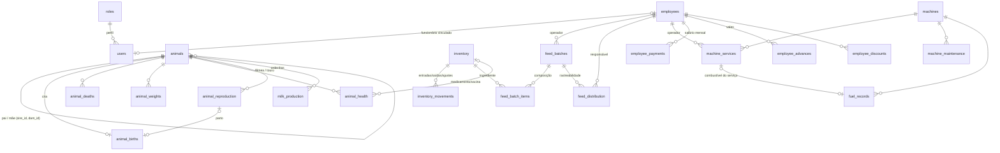

# Fazenda Mar de Rosas — Arquitetura do Sistema de Gestão

Documento técnico do sistema de gestão integrada da **Fazenda Mar de Rosas (Piçarra – PA)**.
Para instalação rápida veja o [README](../README.md).

---

## 1. Princípio

```
LANÇAMENTO SIMPLES → DADOS CENTRALIZADOS → CÁLCULOS AUTOMÁTICOS → HISTÓRICO → INDICADORES → RELATÓRIOS
```

- Cada informação é digitada **uma vez** e reutilizada (ao escolher "Mimosa", o sistema já sabe ID, sexo, raça, situação, nascimento, pais).
- Nenhuma tela grava diretamente em várias tabelas: todo fluxo passa por `js/services.js`, que aplica as regras e as automações.
- Nada importante é apagado: exclusões são lógicas (`deleted_at`) e tudo fica na auditoria.

## 2. Arquitetura

```
┌───────────────────────── Navegador (computador, tablet, celular) ─────────────────────────┐
│  Telas (js/pages/*)  ──►  Formulários (js/forms.js)  ──►  Regras/fluxos (js/services.js)   │
│        ▲                                                         │                          │
│        │  indicadores (js/stats.js) · alertas (js/alerts.js)      ▼                          │
│        └──────────── Banco local em memória + IndexedDB (js/db.js) ── auditoria + fila ──┐  │
│                                                                                        │  │
│  Service worker (sw.js): guarda o app no aparelho → funciona sem internet (PWA)        │  │
└────────────────────────────────────────────────────────────────────────────────────────┼──┘
                                                                                         │ opcional
                                                   Sincronização (js/sync.js) ◄──────────┘
                                                   PostgreSQL / Supabase (docs/schema.sql)
```

**Decisões**

| Decisão | Motivo |
|---|---|
| Aplicativo web estático (HTML + JS, sem etapa de compilação) | Publicável em qualquer hospedagem HTTPS (ex.: GitHub Pages), sem servidor para manter. |
| *Offline-first*: todo lançamento grava primeiro no aparelho (IndexedDB) | Fazenda tem locais sem internet; nenhum dado é perdido. |
| Sincronização opcional com PostgreSQL (Supabase) | Permite vários aparelhos. Sem ela o sistema funciona 100% em um aparelho. |
| Bibliotecas locais em `vendor/` (Chart.js, SheetJS, jsPDF) | Gráficos e exportações funcionam offline. |
| IDs primários UUID gerados no aparelho + código sequencial legível | Criação offline sem colisão; o **ID do animal** (`code`, ex. `00458`) nunca é reutilizado. |

## 3. Estrutura de pastas

```
fazenda/
├── index.html              página única (SPA)
├── manifest.webmanifest    instalação como aplicativo (PWA)
├── sw.js                   cache offline
├── css/app.css             identidade visual e responsividade
├── assets/                 logotipo e ícones
├── vendor/                 Chart.js, SheetJS (Excel), jsPDF + AutoTable (PDF)
├── js/
│   ├── app.js              inicialização, login, menu, rotas, pesquisa global, status online/offline
│   ├── db.js               banco local, auditoria, fila de sincronização, backup
│   ├── schema.js           modelo relacional (fonte única → docs/schema.sql)
│   ├── auth.js             senhas (PBKDF2), sessão, perfis e permissões
│   ├── config.js           valores padrão das configurações
│   ├── services.js         regras de negócio e fluxos automáticos
│   ├── stats.js            indicadores (produção, rebanho, ração, máquinas)
│   ├── alerts.js           central de alertas
│   ├── reports.js          definição dos 37 relatórios
│   ├── forms.js            formulários inteligentes (compartilhados)
│   ├── export.js           Excel / PDF
│   ├── sync.js             sincronização com o servidor
│   ├── seed.js             dados de demonstração
│   └── pages/              telas (dashboard, rebanho, ficha do animal, leite, ração, …)
├── tools/gen-schema.mjs    gera docs/schema.sql
└── docs/                   este documento e o SQL do servidor
```

## 4. Modelo de dados

Todas as tabelas têm: `id` (UUID), `created_at`, `updated_at`, `created_by`, `deleted_at`, `deleted_by`, `delete_reason`, `is_demo`.
A definição completa está em [`js/schema.js`](../js/schema.js) e em [`schema.sql`](schema.sql).



| Área | Tabelas |
|---|---|
| Acesso | `users`, `roles` (permissões em `roles.permissions`; catálogo em `js/auth.js`) |
| Rebanho | `animals`, `animal_births`, `animal_deaths`, `animal_weights`, `animal_health`, `animal_reproduction` |
| Leite | `milk_production` (1 linha por animal + data + ordenha) |
| Ração | `feed_batches`, `feed_batch_items`, `feed_distribution` |
| Estoque | `inventory`, `inventory_movements` |
| Máquinas | `machines`, `machine_services`, `machine_maintenance`, `fuel_records` |
| Funcionários | `employees`, `employee_payments`, `employee_advances`, `employee_discounts` |
| Sistema | `alerts` (estado lido/resolvido/ignorado), `audit_logs`, `settings` |

**Evitar duplicação**
- *Ingredientes da ração são produtos do estoque* (categoria "Ingredientes"): não existe um segundo cadastro de ingredientes; a fabricação baixa o mesmo saldo que o almoxarifado vê.
- Vacinações, medicamentos, tratamentos, doenças e consultas ficam em `animal_health` (campo `type`) — um histórico de saúde único por animal.
- Nome, sexo, raça etc. do animal nunca são copiados para outros registros: só o `animal_id`.

## 5. Fluxos automáticos (`js/services.js`)

| Fluxo | Função | O que acontece |
|---|---|---|
| 1 — Nascimento | `registerBirth` | cria o animal com novo ID → registra nascimento nº N → peso ao nascer → vincula pai e mãe (sugere o pai pela última cobertura da mãe) → encerra a gestação da mãe (data real do parto) → mãe passa para "Em produção" → rebanho, painel, genealogia e linha do tempo se atualizam |
| 2 — Produção | `saveMilk` | registra data/ordenha/usuário; se já existir lançamento do mesmo animal/data/ordenha, **substitui** (não duplica) e audita "de X L para Y L"; total diário = manhã + tarde |
| 3 — Fabricação | `fabricateFeed` | gera lote sequencial → kg por ingrediente (sacos × peso do saco) → baixa cada ingrediente no estoque → cria o saldo de ração pronta → guarda composição, custo e operador; a próxima batida da mesma categoria já vem com a última receita |
| 4 — Distribuição | `distributeFeed` | valida saldo do lote → calcula kg/animal → baixa o saldo do lote → consumo por categoria/local |
| 5 — Mortalidade | `registerDeath` | registra causa e idade → situação "Morto" → sai dos ativos → histórico mantido |
| 6 — Serviço de trator | `saveService` | horas = fim − início (ou horímetro final − inicial) → atualiza horímetro da máquina → combustível informado vira abastecimento vinculado |
| Saúde | `saveHealth` | produto usado sai do estoque; "próxima aplicação" gera alerta |
| Manutenção / combustível | `saveMaintenance`, `saveFuel` | atualizam horímetro; peça ou diesel do tanque saem do estoque |
| Estoque | `stockMove` | atualiza saldo e recalcula custo médio na entrada |
| Salários | `generatePayroll`, `payrollParts` | salário base + adicionais + horas extras − vales − descontos − adiantamentos; vales parcelados caem no mês certo; ao pagar, vales são quitados |

Movimentações de estoque geradas por outros registros guardam `ref_table`/`ref_id`: ao alterar ou excluir o registro de origem, a movimentação é estornada e refeita automaticamente.

## 6. Navegação

```
Login ─► Dashboard (ações rápidas, cards, gráficos, alertas)
         ├─ Visão geral da fazenda (resumo do proprietário)
         ├─ Lançamento rápido ─► Ordenha do turno (lista de vacas) / formulários curtos
         ├─ Rebanho: Animais ─► Ficha do animal (Resumo · Produção · Reprodução · Saúde · Pesagens · Filhos e genealogia · Histórico)
         │           Nascimentos · Mortalidade · Reprodução · Pesagens · Saúde
         ├─ Produção de leite: Registrar · Histórico · Por animal · Painel e comparativos
         ├─ Ração: Ingredientes · Fabricação · Lotes ─► Ficha do lote · Distribuição · Estoque de ração · Consumo
         ├─ Máquinas: Máquinas ─► Ficha · Serviços · Operadores · Horas · Combustível · Manutenção
         ├─ Estoque: Produtos ─► Ficha · Entradas · Saídas · Inventário · Estoque mínimo
         ├─ Funcionários: Cadastro ─► Ficha · Salários · Vales · Descontos · Pagamentos
         ├─ Relatórios (37) ─► filtro · imprimir · PDF · Excel
         ├─ Alertas
         └─ Configurações: Fazenda · Listas · Regras · Usuários · Perfis · Auditoria · Backup · Sincronização · Dados
```

A pesquisa global (barra superior) encontra animal (nome, ID, brinco), funcionário, produto, máquina e lote de ração.

## 7. Regras de negócio e validações

- Brinco único; nome ou brinco obrigatório; pai deve ser macho e mãe fêmea; um animal não pode ser ancestral de si mesmo.
- ID do animal, nº de nascimento e nº de lote são sequenciais e **nunca retrocedem** (exceto ao remover os dados de demonstração, que eram fictícios).
- Produção só para fêmeas; datas futuras bloqueadas; 0–100 L por ordenha.
- Distribuição não pode passar do saldo do lote. Fabricação/saída acima do saldo pede confirmação.
- Lote com distribuição não pode ser cancelado; cancelar um lote devolve os ingredientes ao estoque.
- Animal, funcionário, produto ou máquina **com histórico** não pode ser excluído: altera-se a situação (Vendido/Morto/Desligado/Inativo/Vendida).
- Toda exclusão pede motivo, exige a permissão "Excluir registros" e fica na auditoria.
- CPF validado pelos dígitos verificadores e sem duplicidade.
- Previsão de parto = data da cobertura + dias de gestação da espécie (configurável).

## 8. Usuários e permissões

Perfis padrão (editáveis em Configurações › Perfis, e é possível criar novos):

| Perfil | Acesso |
|---|---|
| Administrador | tudo |
| Gerente | tudo, exceto usuários, backup e configurações |
| Funcionário | lançamentos de leite, ração, máquinas e estoque; vê o rebanho |
| Ordenha | só produção de leite (não vê salários) |
| Estoque | entradas e saídas de estoque (não vê dados financeiros de funcionários) |

Dados pessoais de funcionários (`employees.view`), salários (`payroll.view`) e valores de estoque (`inventory.cost`) são permissões separadas. O menu, as telas, os campos de formulário, os relatórios e a pesquisa respeitam as permissões.

## 9. Alertas

Calculados automaticamente a cada alteração (limites em Configurações › Regras): estoque baixo · vacinação próxima/atrasada · parto próximo/atrasado · gestação confirmada · cobertura sem diagnóstico · manutenção por data ou horímetro · vaca em produção sem lançamento · queda de produção (média 7 dias × 30 dias anteriores) · ração pronta acabando · pagamento de funcionários próximo · cadastros incompletos. Cada alerta pode ser marcado como **lido, resolvido ou ignorado** (e reaberto).

## 10. Segurança

- Senhas com PBKDF2-SHA256 (150 mil iterações, sal aleatório); nunca guardadas em texto.
- Bloqueio de 1 minuto após 5 tentativas erradas; sessão expira após N horas sem uso (configurável).
- Exige HTTPS (ou localhost) — necessário para a criptografia e o funcionamento offline.
- Auditoria automática: usuário, data, hora, ação e valores anteriores/novos
  (ex.: *"João alterou Produção de leite "Mimosa · #00005 — 26/09/2026 Manhã": litros de 18 para 20."*).
- No servidor: RLS ativo em todas as tabelas; somente usuário autenticado lê/grava; `DELETE` não é permitido.

**Limites que o administrador deve conhecer**
- Os dados ficam guardados no navegador do aparelho. O login protege o uso do sistema, mas quem tiver acesso ao aparelho desbloqueado e conhecimento técnico pode ler o banco local. Use aparelhos com senha de bloqueio.
- Na sincronização, todos os aparelhos usam **uma conta de sincronização da fazenda**; as permissões por perfil são aplicadas pelo aplicativo, não pelo servidor.

## 11. Backup

- **Automático**: uma cópia por dia no próprio aparelho (mantém as 10 últimas).
- **Manual**: Configurações › Backup › "Baixar backup agora" (arquivo `.json` com todos os dados) — guarde em pendrive, e-mail ou nuvem.
- **Restauração** (administrador): por arquivo ou por ponto de restauração; antes de restaurar é criado um ponto do estado atual.
- A data do último backup aparece na tela de Backup.

## 12. Offline e sincronização

- O indicador no topo mostra **ONLINE**, **OFFLINE — aguardando sincronização (n)** ou **Sincronizando**.
- Sem internet tudo continua funcionando (login, lançamentos, relatórios, exportações). Os lançamentos ficam numa fila no aparelho.
- Com sincronização configurada, a fila é enviada ao voltar a internet (e a cada minuto). Primeiro o aparelho baixa as novidades, depois envia as suas.
- Conflito (mesmo registro alterado em dois aparelhos): vale a alteração mais recente — garantido também no servidor por gatilho.

### Configurar o servidor (Supabase — plano gratuito atende)

1. Crie um projeto em supabase.com.
2. **SQL Editor** → cole o conteúdo de [`schema.sql`](schema.sql) → **Run**.
3. **Authentication → Users → Add user**: crie o e-mail e a senha da *conta de sincronização* da fazenda.
4. **Project Settings → API**: copie a *Project URL* e a chave *anon public*.
5. No sistema (administrador): **Configurações › Sincronização** → informe URL, chave, e-mail e senha → Conectar.
6. Em outro aparelho: na primeira tela, toque em **"Já uso o sistema em outro aparelho"**, informe os mesmos dados e entre com o seu usuário.

Ao mudar o modelo (`js/schema.js`), gere o SQL de novo com `node tools/gen-schema.mjs`. Campos novos sem coluna no servidor são guardados na coluna `extra` até o SQL ser atualizado.

## 13. Publicação

É um site estático: publique a pasta `fazenda/` em qualquer hospedagem com HTTPS (GitHub Pages, Netlify, Cloudflare Pages, Vercel).
No celular, abra o endereço e use "Adicionar à tela inicial" para instalar como aplicativo.
Para testar localmente: `npx http-server fazenda -p 8080` e abra `http://localhost:8080`.

## 14. Limitações conhecidas

- Dois aparelhos **sem internet** cadastrando animais ao mesmo tempo podem gerar o mesmo número de ID visível (o UUID interno continua único, então nenhum dado se mistura). Recomenda-se cadastrar animais em um aparelho só, ou com internet.
- O cálculo de salários é um **controle administrativo interno**: não calcula INSS, FGTS, IRRF, férias ou 13º.
- Relacionamentos no servidor são indexados e documentados, mas não bloqueados por chave estrangeira (aparelhos offline podem enviar registros relacionados em ordens diferentes); a integridade é garantida pelo aplicativo.
- Fotos de animais são reduzidas para ~480 px para caberem no banco local.

## 15. Verificação

Testado com navegador automatizado (Chromium): as 46 telas, todas as fichas de animais e os 37 relatórios sem erros; fluxos de nascimento, produção (inclusive ordenha do turno), fabricação, distribuição, serviço de máquina (5h30min), mortalidade, estoque/alerta, pesquisa global, permissões por perfil, exportação Excel/PDF, backup/restauração, remoção de dados de demonstração, funcionamento offline e sincronização entre dois aparelhos (servidor simulado). O `schema.sql` foi executado em PostgreSQL real (tabelas, gatilho de "vence o mais recente" e políticas RLS).
